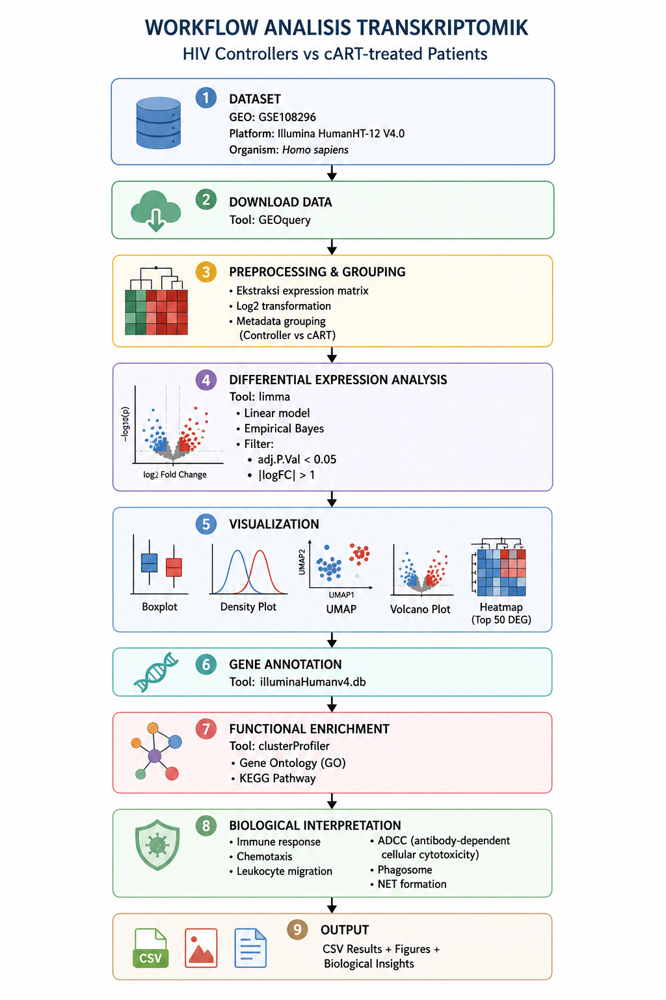
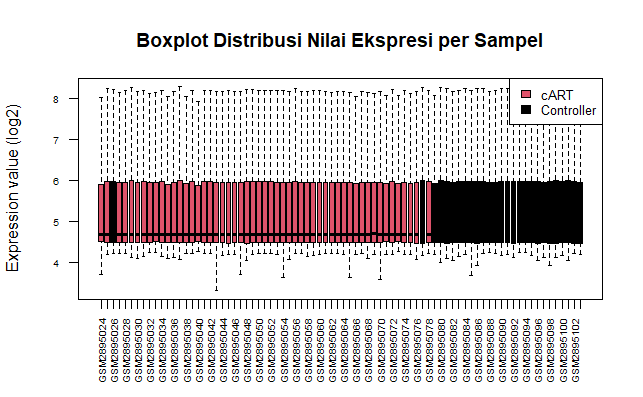
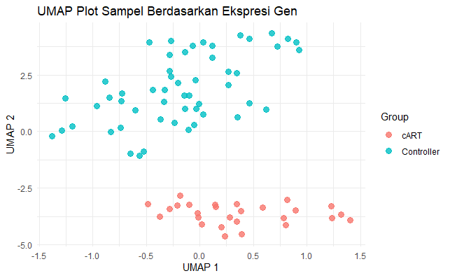
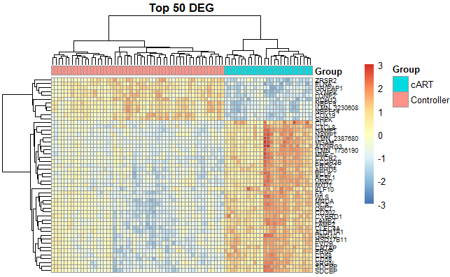

[](https://www.r-project.org/)
[](https://bioconductor.org/)
[](https://opensource.org/licenses/MIT)

# Transcriptomic Analysis of HIV Controllers vs cART-treated Patients

Transcriptomic analysis to identify differences in gene expression regulation between **HIV Controllers** and individuals with **chronic HIV infection receiving combination antiretroviral therapy (cART)** using public gene expression data.

---

## Project Overview

Human Immunodeficiency Virus (HIV) infection causes changes in host cellular gene regulation and immune responses. Although combination antiretroviral therapy (cART) effectively suppresses viral replication, it does not completely eliminate latent reservoirs or fully restore immune function.

A small group of individuals known as HIV Controllers can naturally maintain very low viral loads without antiretroviral treatment.

This project aims to explore transcriptomic differences between these groups to identify genes and biological pathways potentially involved in natural HIV suppression.

---

## Objective

- Identify **Differentially Expressed Genes (DEGs)**
- Compare transcriptomic profiles between:
  - HIV Controllers
  - HIV patients receiving cART
- Perform biological interpretation using:
  - Gene Ontology (GO)
  - KEGG Pathway enrichment

---

## Dataset

| Item | Description |
|---|---|
| Dataset | GSE108296 |
| Source | Gene Expression Omnibus (GEO) |
| Platform | Illumina HumanHT-12 V4.0 |
| Organism | *Homo sapiens* |
| Data Type | Microarray Expression Data |
| Sample Count | 80 Total Samples (53 Controllers, 27 cART) |

---

# Workflow

<p align="center">

</p>

---

## Methods

### 1. Data Acquisition
Gene expression data were downloaded from GEO using GEOquery
```text
gset <- getGEO("GSE108296", GSEMatrix = TRUE, AnnotGPL = TRUE)[[1]]
```

### 2. Preprocessing
- Expression matrix extraction
- Log2 transformation
- Metadata processing
- Sample grouping:
  - Controller
  - cART

### 3. Differential Expression Analysis
Performed using:

- limma
- Linear modeling
- Empirical Bayes

Filtering criteria:

```text
Adjusted p-value < 0.05
|log2 Fold Change| ≥ 1
```

### 4. Gene Annotation
Illumina probe IDs were converted into official gene symbols using:
`illuminaHumanv4.db`

### 5. Functional Enrichment
Biological interpretation was performed using:

- Gene Ontology (GO)
- KEGG Pathway

Packages:

`clusterProfiler`
`org.Hs.eg.db`

---

## Tools & Packages

### Programming
- R
- RStudio

### Packages
- GEOquery
- limma
- ggplot2
- pheatmap
- dplyr
- clusterProfiler
- org.Hs.eg.db
- illuminaHumanv4.db
- umap

---

# Key Findings and Analysis

## Validation of Sample Distribution

Prior to downstream analysis, expression profiles were evaluated to assess data quality and ensure comparability across samples.

<p align="center">

</p>
Expression distribution was examined using boxplot visualization, which showed relatively consistent median expression values and comparable interquartile ranges among all samples. No major deviations or extreme outliers were observed across groups.

This result suggests that the preprocessing and normalization procedures successfully reduced technical variation while preserving biological differences.

<p align="center">

</p>
In addition, dimensionality reduction using UMAP was performed to evaluate global transcriptomic similarity among samples. Samples with similar expression profiles tended to cluster together, indicating that expression patterns were not randomly distributed.

The observed clustering pattern supports the assumption that biological variation contributes more strongly to transcriptomic differences than technical noise.

Overall, quality assessment indicated that the dataset was suitable for differential expression analysis.

## Differential Gene Expression (DEG) Analysis

Differential gene expression analysis was performed to identify genes exhibiting statistically significant expression differences between **HIV Controllers** and **cART-treated individuals**.

The analysis employed the **limma** framework using a linear modeling approach with empirical Bayes moderation to improve variance estimation across genes. Differential expression was defined using the following criteria:

```text
Adjusted p-value < 0.05
|log2 Fold Change| ≥ 1
```

Genes with positive logFC values represent transcripts with relatively higher expression in the **Controller group**, whereas negative logFC values indicate lower expression compared with the **cART group**.

This analysis successfully identified a total of 330 significant DEGs, consisting of 164 upregulated genes (higher expression in Controllers) and 166 downregulated genes compared with cART.

Volcano plot visualization demonstrated clear separation between significant and non-significant genes.

<p align="center">

</p>

- Upregulated genes (red) → significantly increased expression.
- Downregulated genes (blue) → significantly decreased expression.
- Non-significant genes (gray) → expression changes below statistical thresholds.

The distribution pattern observed in the volcano plot indicates that although most genes remained stable between groups, a subset displayed strong transcriptional differences, suggesting biological processes specifically associated with HIV control mechanisms.

Heatmap visualization of the Top 50 DEGs further demonstrated coordinated expression patterns across samples. Samples belonging to the same clinical group tended to cluster together, indicating that DEG profiles captured biologically meaningful differences rather than random variation.

<p align="center">

</p>

- Columns represent individual samples
- Rows represent genes
- Color intensity represents relative gene expression levels: (Red → relatively higher expression), (Blue → relatively lower expression), (Yellow/Intermediate tones → moderate expression)

Expression values were standardized by row (row scaling), allowing comparison of relative expression patterns across samples for each gene.

Hierarchical clustering revealed separation of samples according to biological condition, indicating that transcriptional profiles differ between Controller and cART groups.


## Functional Enrichment Analysis

To investigate the biological significance of DEG profiles, enrichment analysis was performed using Gene Ontology (GO) and KEGG pathway analysis.

#### Gene Ontology (GO)

The Gene Ontology (GO) enrichment analysis revealed that the differentially expressed genes (DEGs) identified between HIV Controllers and cART-treated individuals were significantly associated with immune-related biological processes.

<p align="center">

</p>

The enrichment dotplot showed that chemotaxis and leukocyte migration had among the highest gene ratios and statistical significance, indicating that a substantial proportion of DEGs participate in immune cell movement and recruitment.

This finding suggests that one of the major biological distinctions between HIV Controllers and cART-treated patients may involve differences in how immune cells are mobilized and coordinated during immune surveillance.

Enrichment of acute inflammatory response and cell killing further supports the involvement of activated innate immune mechanisms. These processes are critical for eliminating infected cells and controlling viral dissemination.

Additionally, enrichment in mucosal immune response may reflect the importance of maintaining immune integrity at mucosal barriers, which are recognized as key sites of HIV pathogenesis and immune dysfunction.

#### KEGG Pathway Analysis

KEGG pathway enrichment analysis identified several pathways related to innate immunity and host defense mechanisms.

<p align="center">

</p>

The most enriched pathways included:

- Phagocytosis
- Staphylococcus aureus infection
- Neutrophil extracellular trap formation (NET formation)
- Hematopoietic cell lineage
- Leishmaniasis

Among these pathways, Phagocytosis appeared as one of the strongest enrichment signals.

Phagocytosis is a key mechanism of innate immunity in which immune cells recognize, engulf, and eliminate pathogens or infected cells. Enrichment of this pathway suggests that transcriptional differences between Controller and cART groups may involve altered cellular clearance mechanisms.

The enrichment of Neutrophil Extracellular Trap (NET) formation indicates potential differences in neutrophil activation and extracellular antimicrobial defense. NET formation has previously been linked to inflammatory regulation and chronic immune activation during viral infections.

Although pathways such as Staphylococcus aureus infection and Leishmaniasis appear pathogen-specific, enrichment analysis does not imply co-infection. Instead, these pathways represent shared host immune-response mechanisms involving:

cytokine signaling,
phagocytic activation,
leukocyte recruitment,
antimicrobial defense.

The enrichment of hematopoietic cell lineage suggests possible differences in immune-cell differentiation and maintenance between the two groups.

Taken together, KEGG enrichment results indicate that the transcriptomic differences observed between HIV Controllers and cART-treated individuals are strongly associated with innate immune activation, inflammatory regulation, and host defense pathways.

These findings support the hypothesis that successful HIV control is influenced not only by viral suppression but also by more effective coordination of immune responses.

---

## Author

**Raysha Tryfhatya Nurhaidha**  
Biology Graduate  
Interest: Molecular Biology • Bioinformatics • Microbiology

Linkedln: `linkedin.com/in/rayshatn`
GitHub: `github.com/rayshatn`
Email: `rayshatryfhatya@gmail.com`

---
